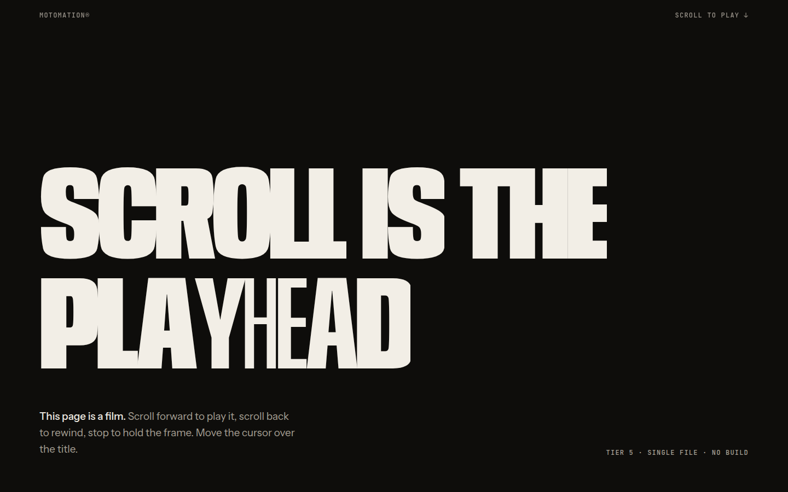
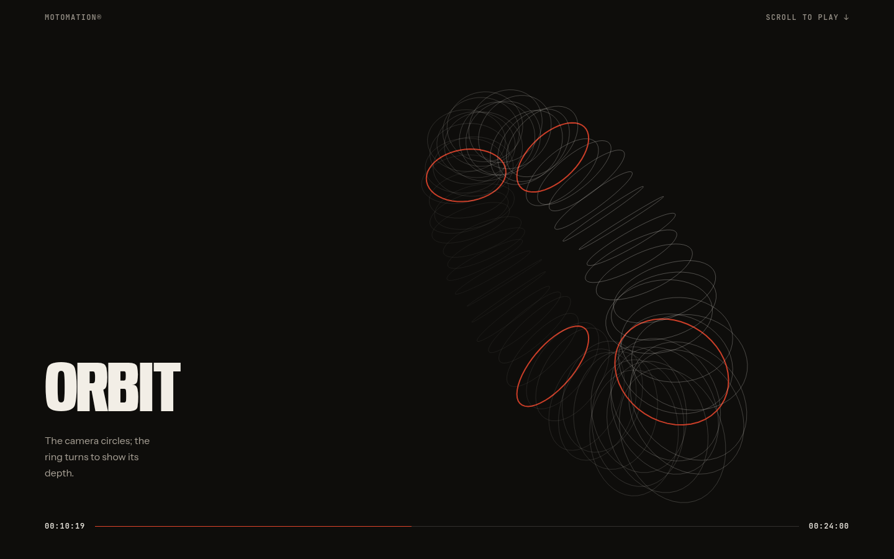

<div align="center">

# Motomation Design

**An agent skill that designs like a person with taste.**
Original, award-level websites that are minimal, modern and typography-led, with motion as the signature.
At the top tier, scrolling plays like a film.

[](LICENSE)
[](CHANGELOG.md)
[](#install)
[](skills/asfakulsiam-motomation-design/scripts)

```bash
npx skills add asfakulsiam/asfakulsiam-motomation-design
```




<sub>Above: <a href="skills/asfakulsiam-motomation-design/examples/html/motomation-film.html">examples/html/motomation-film.html</a>, a complete Tier 5 Motomation page in one HTML file with no build step.</sub>

</div>

---

## Why this exists

Ask any AI for a website and you get the same page: a centred headline, two buttons, a logo wall, three icon features, a purple gradient. The page looks the same because the **thinking** is the same.

Motomation Design changes the thinking:

| | Typical AI output | With Motomation Design |
|---|---|---|
| **Starts with** | A layout template | A **tension** in the brief, resolved into a **concept** |
| **Structure** | Hero → logos → features → pricing | One of 20 **archetypes** (Ledger, Film Reel, Letter, Atlas…), deliberately **mutated** |
| **Ideas** | The most likely next token | A **collision** with an unrelated world, drawn by a real random engine |
| **Memory** | None. It repeats itself | A project log the agent checks, so the next design **actively avoids** recent structural choices |
| **Type** | Inter at 48px | Type is the image, chosen with a reason and set at 8–28vw |
| **Motion** | Fade-up on everything | Five tiers, four questions, reduced motion designed in, and **Motomation** at the top |
| **Delivery** | "Here's your page!" | A six-axis critique score, a 25-point AI-default scan, and a handoff note |

---

## What's inside

- **The Thinking Sequence:** seven steps that make an agent think like a designer: tension → concept → archetype + mutation → forced collision → signature move → anti-sameness check → restraint gate.
- **Mad Artist Mode:** ten invention techniques plus a collision engine (`collide.mjs`) that draws constraints with a cryptographic random number generator instead of the model's most likely choice, without repeats inside a run. It pushes ideas away from the default; it can't promise an idea nobody has had.
- **Five motion tiers:** CSS → GSAP/ScrollTrigger/SplitText/Lenis → View Transitions, Flip, Lottie, Rive → WebGL, shaders, WebGPU → **Motomation**.
- **Motomation (Tier 5):** scroll-as-film. Storyboards with timecodes, image-sequence, video-scrub and DOM-timeline techniques, ffmpeg pipelines, frame budgets, and a designed reduced-motion storyboard.
- **22 signature moves**, each with idea, reason, code, the detail that matters, an off-switch, and a **paste-ready prompt** for any AI tool.
- **A house style:** minimal canvas, maximal type, one accent, editorial grid, motion with weight.
- **3 dials** (Energy, Rhythm, Motion, each 1–3) and 3 moods (Quiet, Editorial, Play).
- **12 site categories** and **10 visual styles**, each with its own guidance.
- **Searchable data:** 44 fonts (with axes and licences), 22 contrast-verified palettes, 29 motion recipes, 20 archetypes, 12 mutations, 40 collision sources.
- **A Delivery Gate:** a self-critique score, a 25-point AI-default scan and a craft checklist.
- **Production examples:** 10 strict-TypeScript React components and a single-file HTML Motomation demo.
- **Evals:** 8 test briefs, a weighted rubric and a release gate against a no-skill baseline.

---

## Install

### Coding agents (recommended)

```bash
npx skills add asfakulsiam/asfakulsiam-motomation-design          # this project
npx skills add asfakulsiam/asfakulsiam-motomation-design -g       # all your projects
npx skills add asfakulsiam/asfakulsiam-motomation-design -a claude-code -a cursor   # specific agents
```

This works with the agents supported by the open [`skills`](https://github.com/vercel-labs/skills) CLI, including **Claude Code, Codex, Cursor, Windsurf, Gemini CLI, GitHub Copilot, Antigravity, Cline, Roo Code, Kiro, OpenCode, Goose, Junie, Amp, Zed** and more.

### Claude Code plugin

```
/plugin marketplace add asfakulsiam/asfakulsiam-motomation-design
/plugin install asfakulsiam-motomation-design@asfakulsiam-motomation-design
```

### Gemini CLI extension

```bash
gemini extensions install https://github.com/asfakulsiam/asfakulsiam-motomation-design
```

### Chat and app builders (ChatGPT, Claude.ai, Grok, Google AI Studio, v0, Lovable, Bolt)

These tools can't run `npx`, so use the single-file edition: **[`dist/motomation-design.md`](dist/motomation-design.md)**.

| Tool | Where to put it |
|---|---|
| **ChatGPT** | Project files or a custom GPT's knowledge, plus the instruction *"Follow motomation-design.md for every web design task."* |
| **Claude.ai** | Project knowledge, or upload the `skills/asfakulsiam-motomation-design` folder as a skill where your plan supports it |
| **Grok / Google AI Studio / Gemini** | Paste it into the system instructions, or attach it to the chat |
| **v0 / Lovable / Bolt / Replit** | Project knowledge, rules or custom instructions |

Without a shell, the skill uses the data tables included at the end of the file instead of its scripts.

### Update

```bash
npx skills update asfakulsiam-motomation-design
```

---

## Quick start

```text
/build portfolio for a motion designer in Dhaka who wants title-sequence work
/shape boutique hotel in a restored 1890s house in Puran Dhaka --mood=quiet
/invent ceramics shop
/motomate the product chapter --tier=5
/critique https://your-site.com
```

Or just ask in plain words ("design a landing page for my app"). The skill triggers on any web design task and runs `/build` by default.

---

## Commands

Each command lists **what** it does, **when** to use it and **where** it applies.

### Create

| Command | What it does | When to use it | Where it applies |
|---|---|---|---|
| `/shape [brief]` | Turns a brief into a direction **without code**: brief inference, Thinking Sequence, dials, `DESIGN.md` + `MOTION.md` | At the very start, or when a client must approve the direction | A new project or page |
| `/build [brief]` | The full flow: plan → preview block → complete code → Delivery Gate → handoff | You want a finished page or site | New pages, whole sites |
| `/invent [topic]` | Runs the collision engine and proposes **3 different concepts** | You're stuck, or the first idea feels familiar | Before `/build`, or to rethink a section |
| `/signature [section]` | Invents **one** memorable move tied to the concept | The page works but nobody will remember it | A hero, a section or a whole site |
| `/motomate [section]` | Turns a section into a **Tier 5 scroll-film**: storyboard, technique, assets, code, fallback | A product, place or story should play like a film | Product launches, hero chapters, case studies |
| `/animate [target] --tier=n` | Adds motion at a given tier, following the four questions | The design is done but static | Any existing component or page |
| `/type [target]` | Typography pass: face, scale, tracking, wrapping, numerals, variable axes | The page feels generic (it's usually the type) | Any page |

### Tune

| Command | What it does | When to use it | Where it applies |
|---|---|---|---|
| `/bolder [target]` | Raises ENERGY one step: bigger type jumps, braver accent, one more grid break | It's correct but timid | Heroes, landing pages |
| `/quieter [target]` | Lowers ENERGY/MOTION one step: more air, fewer moving parts | It's busy or tiring | Content pages, organisations |
| `/distill [target]` | Cuts to the essential: one signature, one accent, fewer sections | It tries to do too much | Anywhere |
| `/mutate [target]` | Keeps the content, changes the **structure** (new archetype or mutation) | The layout feels like a template | Homepages, landing pages |
| `/overdrive [target]` | Generate → critique → improve loop, up to 3 rounds, until every axis scores 4+ | Flagship pages that must be excellent | Homepages, launch pages |

### Evaluate and ship

| Command | What it does | When to use it | Where it applies |
|---|---|---|---|
| `/critique [target or URL]` | A scored design review: top 3 problems, fixes, what to keep | Before revisions, or to review any site | Your work or a reference |
| `/audit [target]` | A technical gate: accessibility, performance, reduced motion, mobile matrix, SEO, AI-default scan | Before launch | Any codebase |
| `/study [URL or screenshot]` | Extracts the **design DNA** of a reference without copying it | You love a site and want its principles, not its layout | References and competitors |
| `/polish [target]` | The last pass: spacing, details, states, OG image, stamp and memory log | Right before shipping | Finished pages |

### Meta

| Command | What it does |
|---|---|
| `/dials` | Shows or sets the dials: `/dials energy=3 motion=2` |
| `/help` | Lists commands and suggests your next step |
| `/version` · `/check-update` · `/update-skill` | Version info and update instructions |

### Flags

`--tier=1..5` · `--energy=1..3` · `--rhythm=1..3` · `--motion=1..3` · `--mood=quiet|editorial|play` · `--style=<name>` · `--stack=next|react|vanilla|astro` · `--seed=<n>` · `--review` (stop after the plan)

### Typical sequences

- **New site:** `/shape` → approve → `/build` → `/critique` → `/polish`
- **Stuck:** `/invent` → pick one → `/build --review`
- **Existing site feels generic:** `/critique` → `/mutate` → `/type` → `/signature`
- **Product launch:** `/shape --mood=play` → `/motomate hero-product` → `/audit`

---

## How it thinks

```
MOTOMATION PLAN
Tension     : 10 years of varied work ↔ clients remember one thing
Concept     : The site is a single film reel; each project is a frame you scrub through
Archetype   : Film Reel, mutated by "invert the axis" (the reel runs sideways while the page scrolls down)
Collision   : 35mm contact sheet → frame numbers, sprocket rail, grease-pencil hover circles
Signature   : Hovering a project circles it in grease pencil; the reel rewinds with a film-leader countdown
Dials       : ENERGY 3 · RHYTHM 2 · MOTION 3 → Tier 5
Type        : Big Shoulders Display / Switzer (cinematic condensed + quiet text)
Palette     : Darkroom: #0E0D0B · #F2EEE6 · safelight #E0442B
Not doing   : A bento grid of thumbnails under "Hi, I'm Rafi"
```

The agent shows this block before it writes any code. Every line comes from a step of the [Thinking Sequence](skills/asfakulsiam-motomation-design/thinking/sequence.md).

---

## Motion tiers

| Tier | Name | Tools | Use it for |
|---|---|---|---|
| 1 | Basic | CSS transitions, keyframes, same-page View Transitions | Every site: hover, focus, press, small reveals |
| 2 | Intermediate | GSAP, ScrollTrigger, SplitText, Lenis | Kinetic type, line reveals, pinned moments |
| 3 | Pro | Cross-page View Transitions, Flip, Lottie, Rive, MorphSVG | Page continuity, illustrated and interactive motion |
| 4 | Max | Three.js, OGL, GLSL, WebGPU | When the concept is spatial, material or lit |
| 5 | **Motomation** | Scrubbed timelines + image sequences / video + optional WebGL, synced by Lenis | Scroll that plays like After Effects |

The rule: **use the lowest tier that delivers the concept.** Tier 5 is the signature, not the default.

---

## Tools inside the skill

Zero-dependency Node.js scripts (Node 18+). No `npm install` needed.

```bash
cd skills/asfakulsiam-motomation-design      # or your agent's skills folder, e.g. .claude/skills/…
node scripts/collide.mjs --n 3 --spread --category hotel     # real random creative constraints
node scripts/search.mjs fonts "condensed cinematic"          # BM25 search over curated data
node scripts/search.mjs motion "pinned scrub" --tier 5
node scripts/memory.mjs recent                               # what this project already used
node scripts/memory.mjs check --archetype ledger             # exits 2 if it was used recently
node scripts/contrast.mjs "#151412" "#F3F0EA"                # WCAG contrast
```

---

## Categories and styles

**Categories:** portfolio · studio/agency · e-commerce · SaaS · hotel · restaurant · organisation/non-profit · event · architecture/real estate · personal brand · product launch · education

**Styles:** minimal · editorial · swiss · neobrutalism · glass · soft/neumorphism · flat/illustrative · kinetic type · organic · dark luxe

Each has its own file with default dials, archetypes, section order, a signature menu, must-haves and pitfalls.

---

## Repository layout

```
skills/asfakulsiam-motomation-design/   ← the installable skill
  SKILL.md            router + core protocol
  thinking/           brief inference, the Thinking Sequence
  invention/          Mad Artist Mode
  structures/         20 page archetypes, section purposes
  principles/         house style, dials, typography, colour, layout, restraint
  motion/             tokens + tiers 1–5 (Motomation)
  signatures/         22 signature-move recipes with prompts
  styles/ categories/ visual languages and site types
  craft/              accessibility, performance, responsive, mobile matrix, SEO, copy
  gates/              the Delivery Gate
  commands/           every command, critique format, updating
  adapters/           Next.js, React + Vite, vanilla, Astro, platform notes
  references/         GSAP + Lenis, effects vocabulary, inspiration libraries
  templates/          DESIGN.md, MOTION.md
  data/               searchable CSVs
  scripts/            collide, search, memory, contrast
  examples/           React components + single-file HTML demo
dist/motomation-design.md   ← single-file edition for chat tools
evals/                       ← test briefs, rubric, release gate
.claude-plugin/ .cursor-plugin/ .codex-plugin/ gemini-extension.json rules/
```

---

## FAQ

**Will it always use heavy animation?**
No. It picks the lowest tier that delivers the concept. A government service gets Tier 1. Motomation is reserved for stories that should play like a film.

**Does it work without a terminal?**
Yes. Use `dist/motomation-design.md`. The agent picks from the included data tables instead of running scripts.

**Will two sites made with it look the same?**
It actively detects and reduces repetition, but it can't guarantee two sites will never look alike. What exists: the collision engine never repeats an archetype or signature inside one run and reports when a pool runs out; `memory.mjs check` flags archetypes, signatures, fonts, palettes and tiers already used in this project's last five runs; and the Thinking Sequence's anti-sameness step compares structure, type, colour, motion, signature and imagery against the obvious version. Limits: memory only sees the project it lives in, and the no-terminal edition relies on the agent following the rules. The variety eval in `evals/` has not been run and published yet.

**Which stack does it target?**
It detects your stack, and defaults to Next.js App Router + Tailwind. Adapters cover React + Vite, plain HTML and Astro.

**Is GSAP free?**
Yes. GSAP and all its plugins (SplitText, ScrollTrigger, MorphSVG and more) are free, including for commercial use, under GSAP's own Standard License.

**Can I use effects from component libraries?**
Yes, in your project, under each library's license. The skill describes effects as concepts in its own words and never bundles third-party component code.

---

## Contributing

See [CONTRIBUTING.md](CONTRIBUTING.md). In short: original work only, short single-purpose files, run `node scripts/check-repo.mjs`, and add an eval brief for new behaviour.

## License

[MIT](LICENSE) © asfakulsiam
