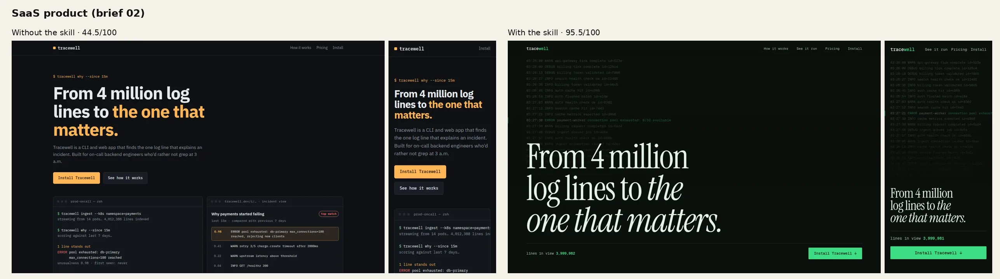
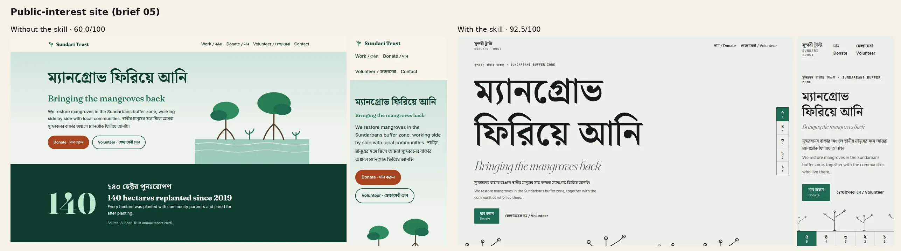
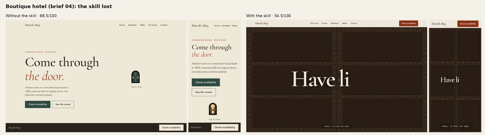

# Benchmark summary · 2026-10-11

Full report with every screenshot, score and measurement: [`evals/results/2026-10-11-benchmark.md`](../evals/results/2026-10-11-benchmark.md).

## What was compared
The same model (`claude_sonnet_5_5`, same settings) built five briefs twice. The baseline got the brief alone. The skill run got the brief plus the Motomation skill and its `/invent` output. Two blind judges from other model families (GPT-5.4, Gemini 3.1 Pro) scored each pair with `evals/rubric.md`. Hard gates were applied from Playwright + axe-core measurements.

## Scores (gated, /100, mean of two judges)

| Brief | Without | With | Δ |
|---|---|---|---|
| Studio portfolio (07) | 81.5 | 0.0 | -81.5 |
| Boutique hotel (04) | 88.5 | 54.5 | -34.0 |
| E-commerce product (03) | 0.0 | 88.0 | +88.0 |
| SaaS product (02) | 44.5 | 95.5 | +51.0 |
| Public-interest (05) | 60.0 | 92.5 | +32.5 |
| **Mean** | 54.9 | 66.1 | +11.2 |

Mean axis scores over the five briefs (1–5, before gates):

| Axis | Without | With |
|---|---|---|
| Concept | 3.5 | 4.5 |
| Originality | 2.9 | 4.7 |
| Typography | 3.5 | 4.4 |
| Motion | 3.1 | 3.9 |
| Craft | 3.6 | 3.9 |
| Access & performance | 3.8 | 2.9 |

## Before and after

SaaS: a generic template that overflows on a phone, vs the Console archetype, where the terminal session is the page.

Public-interest: a conventional layout vs a bilingual manifesto that keeps the single real figure with its source.

Hotel, where the skill lost: the door-split hero breaks the name into "Have li", the page overflows the phone by 105px, and room prices flip through wrong digits.

## What it means
- The skill reliably moved structure, originality and typography. On Originality it scored higher on 4 of 5 briefs.
- It did not reliably improve craft. In 2 of 5 briefs it shipped defects that its own delivery gate lists (contrast, mobile overflow, motion that misstates content). Without a browser in the loop, the model stamps the gate as passed anyway.
- The release gate ("higher on every brief, no hard-gate failures") is **not met**.

## Failures (not fixed)
1. Release gate not met: the skill lost hotel (54.5 vs 88.5) and, after gates, studio (0 vs 81.5).
2. Self-critique stamps were identical across all five outputs (`C5 H4 S5 R4 M4 V5`, copied from the example) and don't track quality.
3. Signature IDs in stamps were invented, not taken from `data/signatures.csv`.
4. A measurement bug (closed cart drawer counted as "hidden under reduced motion") affected both e-commerce pages; it's disclosed and not used as a gate.
5. The same `/invent` seed was used for every brief, so mutations repeated across briefs (an artifact of the benchmark, not of a single run).

## Not verified
n = 1 per cell; one generator model; raw API calls, not an agent running the skill's scripts; motion judged from stills; the variety test was not run; the skill prompt is ~45k tokens longer than the baseline's.
