# Benchmark · 2026-10-11 · 5 briefs, with and without the skill

**Result in one line:** the skill version scored higher on 3 of 5 briefs (e-commerce, SaaS, public-interest) by 24 to 51 points, tied on the studio brief before gates and lost on it after them, and lost the hotel brief by 34 points. **The release gate in `evals/README.md` ("higher on every brief, no hard-gate failures") is not met.**

## Setup

| | |
|---|---|
| Generator | `claude_sonnet_5_5`, reasoning effort medium, max 64k output tokens, one shot per brief and condition (n = 1) |
| Baseline | system prompt: "You are an expert web designer and front-end developer. Build the website described in the brief. Return the complete index.html…" + the brief |
| Skill | the same system prompt + `dist/motomation-design.md` (commit at Task 8) + the output of `collide.mjs --n 3 --spread --category <cat> --seed 2026` (what `/invent` would print) |
| Shared constraints | each brief's "Benchmark conditions": one self-contained `index.html`, Google Fonts/Fontshare and GSAP CDN only, no image URLs, facts only from the brief |
| Screenshots | Playwright Chromium, 1440×900 and 375×812, normal and `prefers-reduced-motion: reduce`; first screen + page (capped at 6 screens) after scrolling through once |
| Measured checks | axe-core 4 (WCAG 2 A/AA), keyboard (Tab ×40: reaches the brief's primary action? visible focus ring?), text left at opacity 0 under reduced motion, horizontal overflow at 375px, JS errors, placeholder strings |
| Judges | **blind**, two different model families from the generator: `gpt_5_4` and `gemini_3_1_pro`. Each saw both sites as "A" and "B" (order shuffled per brief, recorded in `judge/*.json`), the brief, `evals/rubric.md` and the measured checks. No code, no stamp comments. |
| Scoring | rubric axes 1–5, weighted total /100, mean of the two judges. **Hard gates are applied from measurements, not from judge opinion** (a judge's gate claim is checked against the source first). |

## Scores

| Brief | Baseline (raw → gated) | Skill (raw → gated) | Δ gated | Gate failures |
|---|---|---|---|---|
| Studio portfolio · brief 07 | 81.5 → **81.5** | 80.0 → **0.0** | -81.5 | skill: contrast: 5 figcaptions at 4.45:1 |
| Boutique hotel · brief 04 | 88.5 → **88.5** | 54.5 → **54.5** | -34.0 | none |
| E-commerce product · brief 03 | 63.5 → **0.0** | 88.0 → **88.0** | +88.0 | baseline: contrast: eyebrow label at 4.39:1 |
| SaaS product · brief 02 | 44.5 → **44.5** | 95.5 → **95.5** | +51.0 | none |
| Public-interest website · brief 05 | 60.0 → **60.0** | 92.5 → **92.5** | +32.5 | none |
| **Mean** | 67.6 → **54.9** | 82.1 → **66.1** | +11.2 | |

Axis means (both judges), baseline → skill:

| Brief | Concept | Originality | Typography | Motion | Craft | Access & performance |
|---|---|---|---|---|---|---|
| Studio portfolio | 4.5 → 4.5 | 3.5 → 5.0 | 4.0 → 4.5 | 3.5 → 4.0 | 4.0 → 4.0 | 5.0 → 1.5 |
| Boutique hotel | 4.5 → 3.0 | 4.5 → 3.5 | 4.5 → 2.5 | 3.5 → 3.5 | 4.5 → 2.0 | 5.0 → 1.5 |
| E-commerce product | 3.5 → 5.0 | 3.0 → 5.0 | 3.5 → 5.0 | 3.0 → 4.0 | 4.0 → 4.5 | 2.0 → 2.5 |
| SaaS product | 2.5 → 5.0 | 1.5 → 5.0 | 2.5 → 5.0 | 3.0 → 4.0 | 1.5 → 4.5 | 2.5 → 5.0 |
| Public-interest website | 2.5 → 5.0 | 2.0 → 5.0 | 3.0 → 5.0 | 2.5 → 4.0 | 4.0 → 4.5 | 4.5 → 4.0 |

## Studio portfolio · brief 07

Brief: [`evals/briefs/07-architecture-studio.md`](../briefs/07-architecture-studio.md) · outputs: [`baseline`](2026-10-11-benchmark/studio/baseline/index.html), [`skill`](2026-10-11-benchmark/studio/skill/index.html)

| | Baseline | Skill |
|---|---|---|
| 1440 · first screen | 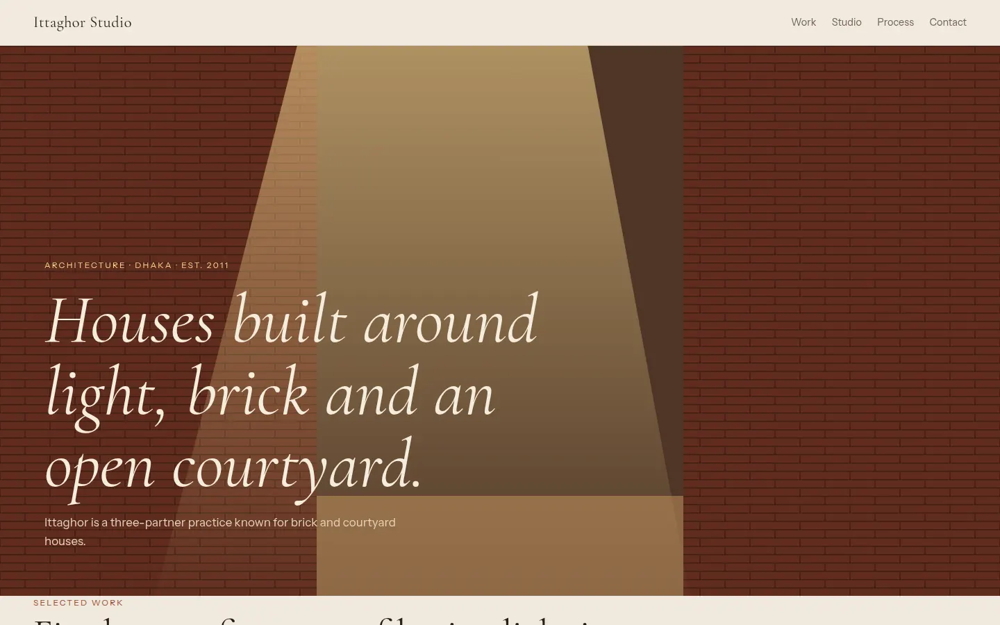 | 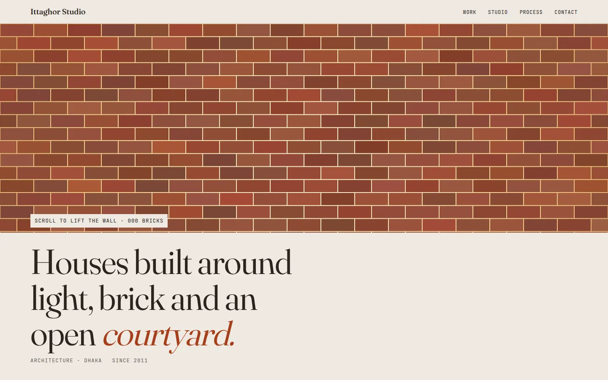 |
| 1440 · page | 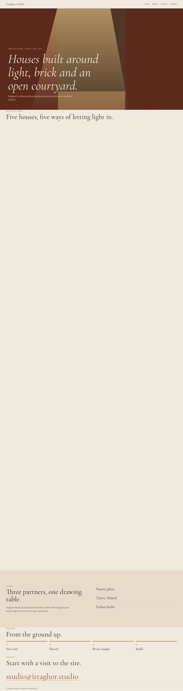 | 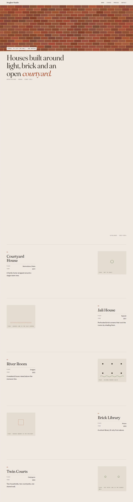 |
| 375 · page | 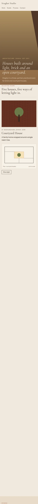 | 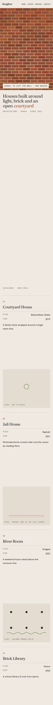 |
| 1440 · reduced motion | 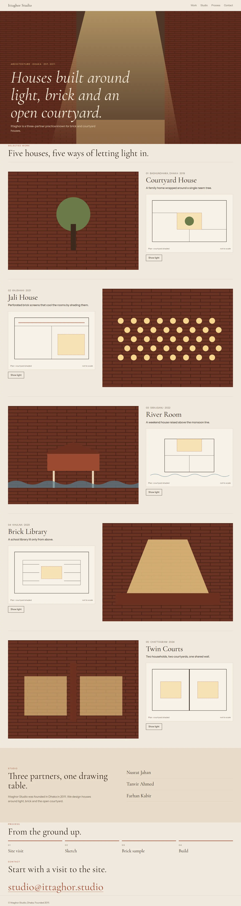 | 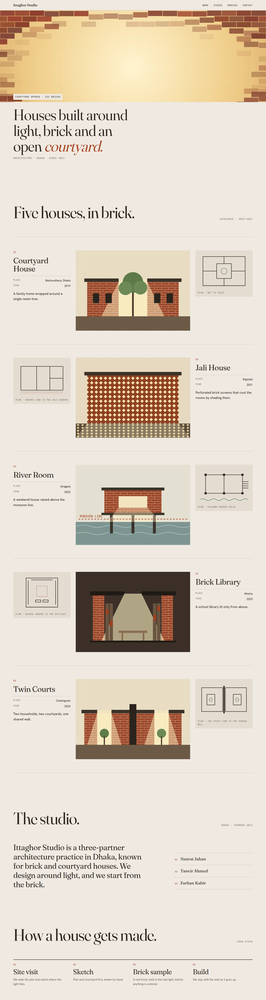 |
| 375 · reduced motion | 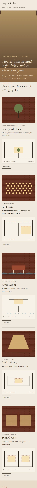 | 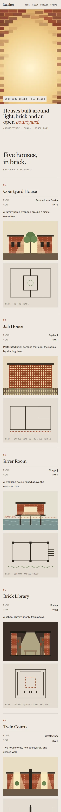 |

| Axis | baseline · GPT-5.4 | baseline · Gemini 3.1 | skill · GPT-5.4 | skill · Gemini 3.1 |
|---|---|---|---|---|
| Concept | 4 | 5 | 5 | 4 |
| Originality | 3 | 4 | 5 | 5 |
| Typography | 4 | 4 | 5 | 4 |
| Motion | 3 | 4 | 4 | 4 |
| Craft | 4 | 4 | 4 | 4 |
| Access & performance | 5 | 5 | 1 | 2 |
| **Weighted** | 76 | 87 | 82 | 78 |

| Measured | axe WCAG A/AA | keyboard → primary action | overflow @375 | text hidden (RM) | network idle | HTML |
|---|---|---|---|---|---|---|
| baseline | 0 | step 6 · ring 37/40 | 0px | 0 | 1930 ms | 12 KB |
| skill | color-contrast×5 | step 6 · ring 36/40 | 0px | 0 | 1510 ms | 25 KB |

**What changed:** Both versions read as architecture sites, and the judges split. The skill version (archetype Catalogue, mutation Reverse the reveal, a brick wall that lifts away as you scroll) scored higher on Originality (5.0 vs 3.5) and Typography, but its five plan captions measure 4.45:1, just under the 4.5:1 body-text gate, so under the rubric it scores 0. The baseline's light-shaft hero was the judges' preferred concept on Gemini. Net: the skill changed the structure and voice, but it didn't win this brief, and its own gate should have caught the caption contrast.

## Boutique hotel · brief 04

Brief: [`evals/briefs/04-boutique-hotel.md`](../briefs/04-boutique-hotel.md) · outputs: [`baseline`](2026-10-11-benchmark/hotel/baseline/index.html), [`skill`](2026-10-11-benchmark/hotel/skill/index.html)

| | Baseline | Skill |
|---|---|---|
| 1440 · first screen | 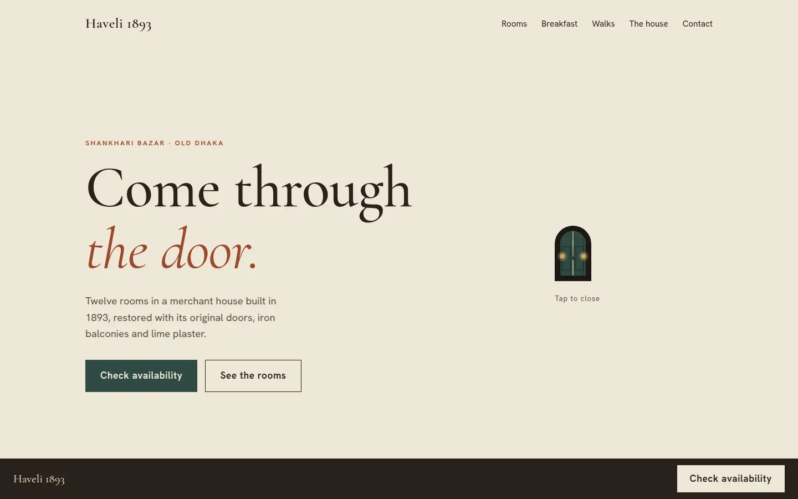 | 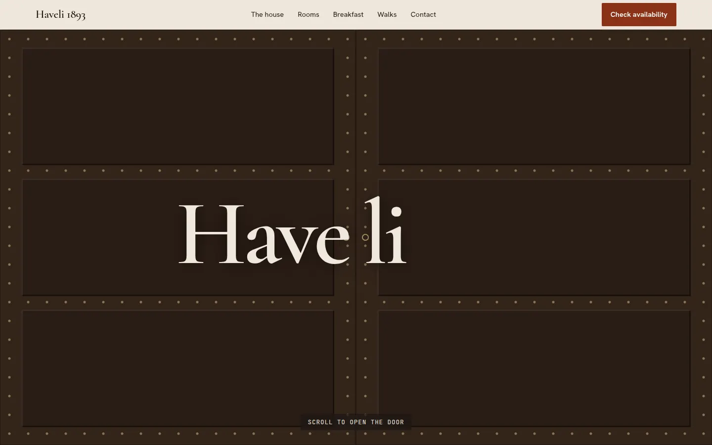 |
| 1440 · page | 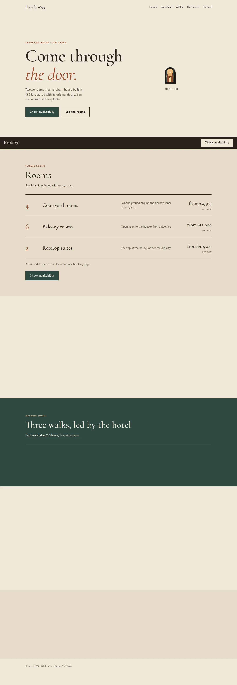 | 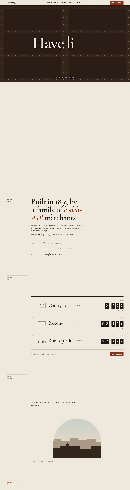 |
| 375 · page | 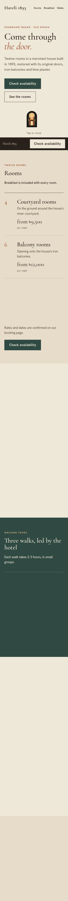 | 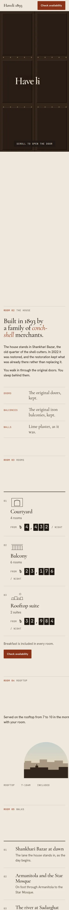 |
| 1440 · reduced motion | 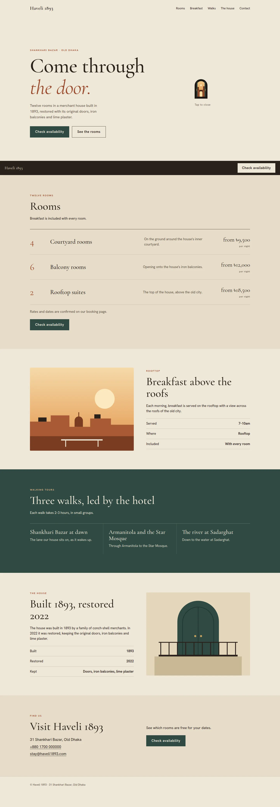 | 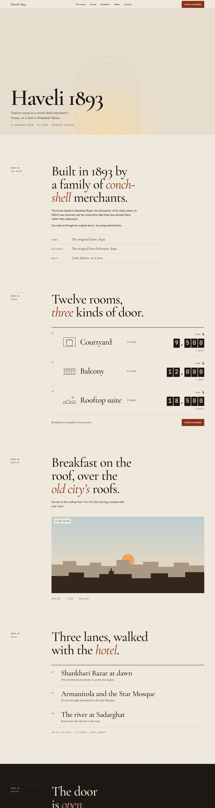 |
| 375 · reduced motion | 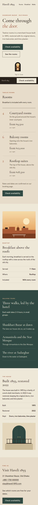 | 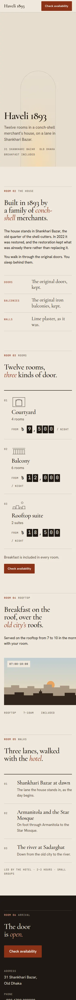 |

| Axis | baseline · GPT-5.4 | baseline · Gemini 3.1 | skill · GPT-5.4 | skill · Gemini 3.1 |
|---|---|---|---|---|
| Concept | 4 | 5 | 4 | 2 |
| Originality | 4 | 5 | 5 | 2 |
| Typography | 4 | 5 | 4 | 1 |
| Motion | 3 | 4 | 4 | 3 |
| Craft | 4 | 5 | 2 | 2 |
| Access & performance | 5 | 5 | 1 | 2 |
| **Weighted** | 80 | 97 | 69 | 40 |

| Measured | axe WCAG A/AA | keyboard → primary action | overflow @375 | text hidden (RM) | network idle | HTML |
|---|---|---|---|---|---|---|
| baseline | 0 | step 7 · ring 38/40 | 0px | 0 | 1052 ms | 15 KB |
| skill | color-contrast×1 | step 8 · ring 37/40 | 105px | 0 | 1927 ms | 23 KB |

**What changed:** This is the skill's worst brief. The skill version (Room archetype, door-threshold signature, folios in the margin) has three visible defects. The hero word "Haveli" splits into "Have li" on a phone. The page overflows the 375px viewport by 105px. And a departure-board price flip was captured mid-animation, showing ৳4,322 instead of ৳9,500. The source prices are correct (`aria-label="9,500 taka per night"`), so the Gemini judge's "invented prices" gate was not applied, but a visitor would still see the wrong number while it flips. The judges disagreed strongly (GPT-5.4: 69, Gemini 3.1 Pro: 40). The baseline was calm, accurate and polished (88.5).

## E-commerce product · brief 03

Brief: [`evals/briefs/03-ceramics-shop.md`](../briefs/03-ceramics-shop.md) · outputs: [`baseline`](2026-10-11-benchmark/ecommerce/baseline/index.html), [`skill`](2026-10-11-benchmark/ecommerce/skill/index.html)

| | Baseline | Skill |
|---|---|---|
| 1440 · first screen | 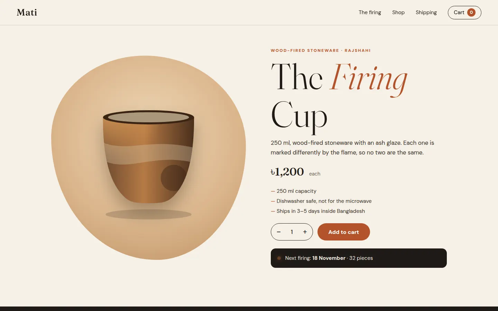 | 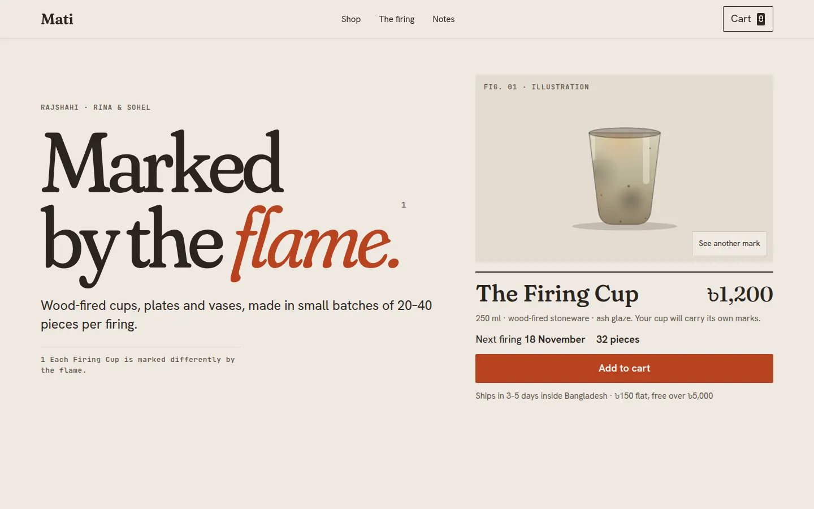 |
| 1440 · page |  | 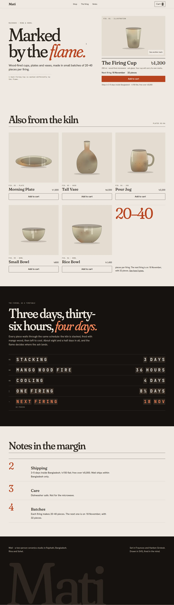 |
| 375 · page |  | 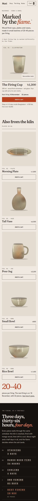 |
| 1440 · reduced motion | 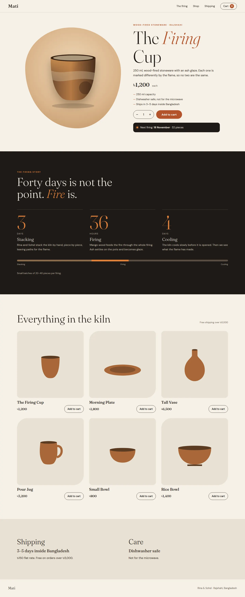 | 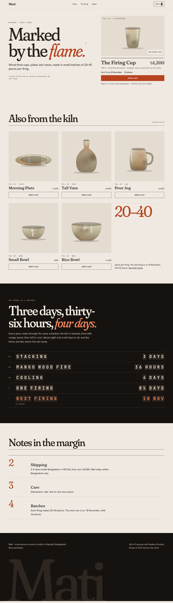 |
| 375 · reduced motion | 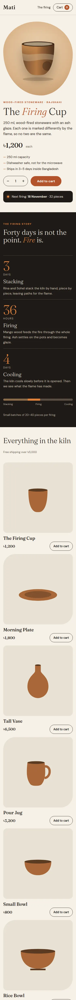 |  |

| Axis | baseline · GPT-5.4 | baseline · Gemini 3.1 | skill · GPT-5.4 | skill · Gemini 3.1 |
|---|---|---|---|---|
| Concept | 4 | 3 | 5 | 5 |
| Originality | 3 | 3 | 5 | 5 |
| Typography | 4 | 3 | 5 | 5 |
| Motion | 3 | 3 | 4 | 4 |
| Craft | 4 | 4 | 4 | 5 |
| Access & performance | 1 | 3 | 1 | 4 |
| **Weighted** | 64 | 63 | 82 | 94 |

| Measured | axe WCAG A/AA | keyboard → primary action | overflow @375 | text hidden (RM) | network idle | HTML |
|---|---|---|---|---|---|---|
| baseline | color-contrast×1 | step 9 · ring 38/40 | 0px | 3 | 1030 ms | 17 KB |
| skill | color-contrast×1 | step 8 · ring 38/40 | 0px | 3 | 954 ms | 28 KB |

**What changed:** The skill version turns the shop into a field guide with marginalia and a flip-board firing schedule. Both judges rated it far more original and typographically stronger (Typography 5.0 vs 3.5). The baseline fails the contrast gate (a 4.39:1 eyebrow label), so its gated score is 0. Both pages had the cart drawer flagged as hidden under reduced motion. That was a false positive in my check (the drawer is closed by design), and it lowered both conditions' Access & performance score from GPT-5.4 equally. It is listed under Failures.

## SaaS product · brief 02

Brief: [`evals/briefs/02-dev-tool-landing.md`](../briefs/02-dev-tool-landing.md) · outputs: [`baseline`](2026-10-11-benchmark/saas/baseline/index.html), [`skill`](2026-10-11-benchmark/saas/skill/index.html)

| | Baseline | Skill |
|---|---|---|
| 1440 · first screen | 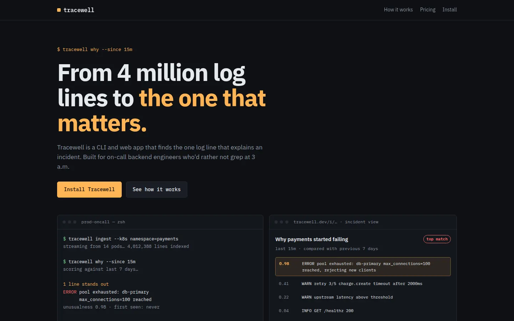 | 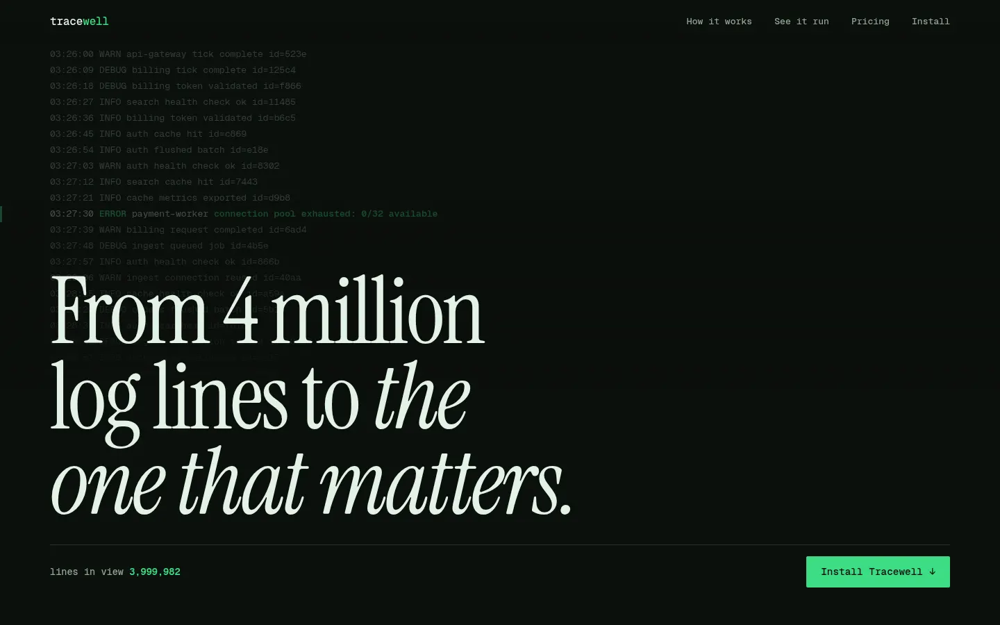 |
| 1440 · page | 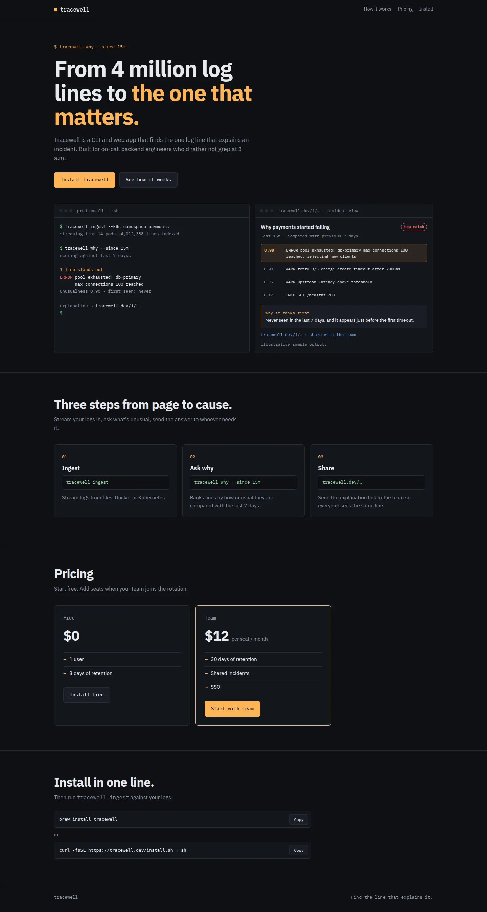 | 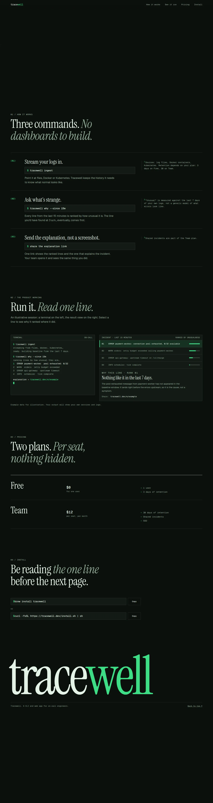 |
| 375 · page | 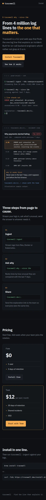 | 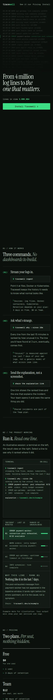 |
| 1440 · reduced motion |  | 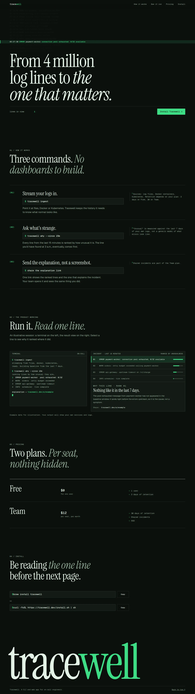 |
| 375 · reduced motion |  | 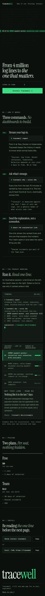 |

| Axis | baseline · GPT-5.4 | baseline · Gemini 3.1 | skill · GPT-5.4 | skill · Gemini 3.1 |
|---|---|---|---|---|
| Concept | 3 | 2 | 5 | 5 |
| Originality | 2 | 1 | 5 | 5 |
| Typography | 3 | 2 | 5 | 5 |
| Motion | 3 | 3 | 4 | 4 |
| Craft | 2 | 1 | 4 | 5 |
| Access & performance | 2 | 3 | 5 | 5 |
| **Weighted** | 50 | 39 | 94 | 97 |

| Measured | axe WCAG A/AA | keyboard → primary action | overflow @375 | text hidden (RM) | network idle | HTML |
|---|---|---|---|---|---|---|
| baseline | 0 | step 4 · ring 37/40 | 110px | 0 | 1752 ms | 13 KB |
| skill | 0 | step 5 · ring 38/40 | 0px | 0 | 1043 ms | 23 KB |

**What changed:** This is the biggest gap. The baseline is a generic hero, features and pricing page that overflows 110px on a phone; both judges called it template-like (Originality 1.5). The skill version follows the Console archetype: the page is a terminal session that runs `tracewell ingest` → `tracewell why`, with pricing set as CLI output, and no invented logos or numbers. It passed every measured check.

## Public-interest website · brief 05

Brief: [`evals/briefs/05-climate-nonprofit.md`](../briefs/05-climate-nonprofit.md) · outputs: [`baseline`](2026-10-11-benchmark/public/baseline/index.html), [`skill`](2026-10-11-benchmark/public/skill/index.html)

| | Baseline | Skill |
|---|---|---|
| 1440 · first screen | 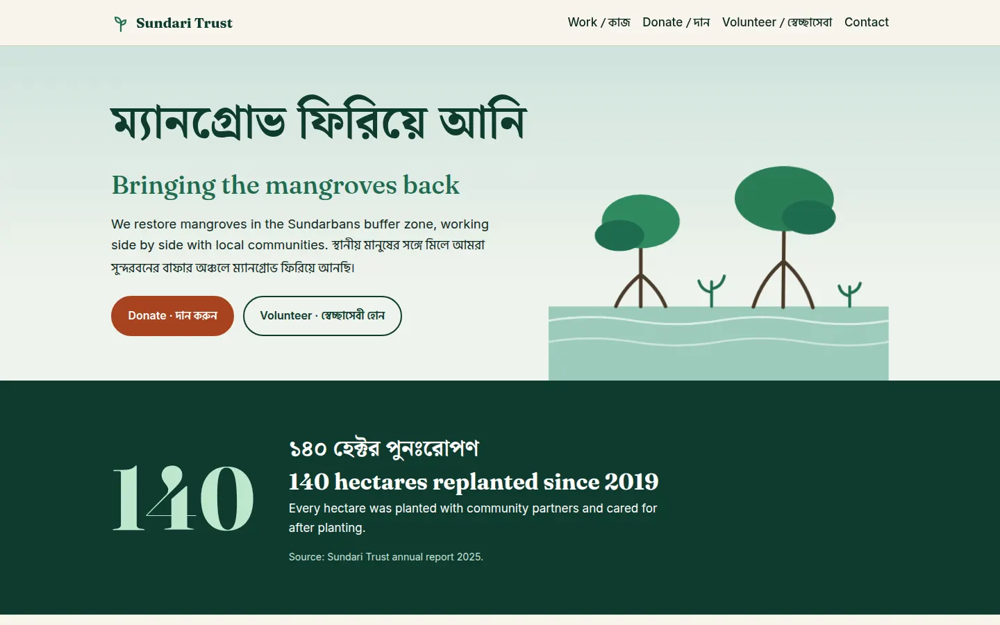 | 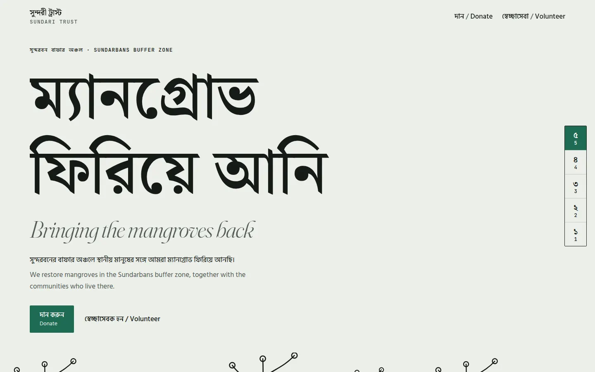 |
| 1440 · page | 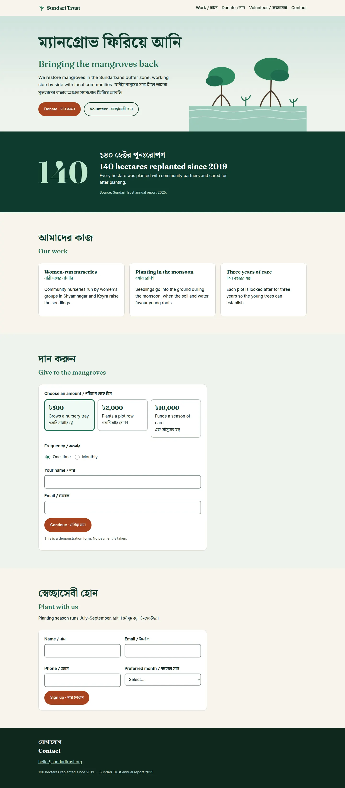 | 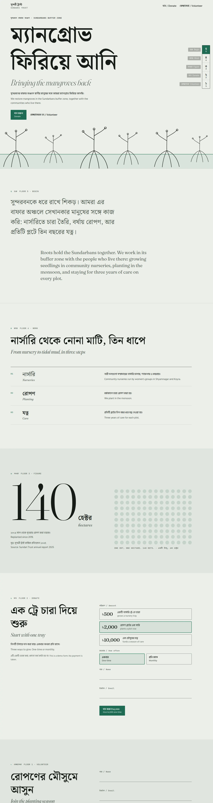 |
| 375 · page |  | 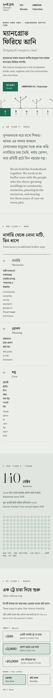 |
| 1440 · reduced motion |  | 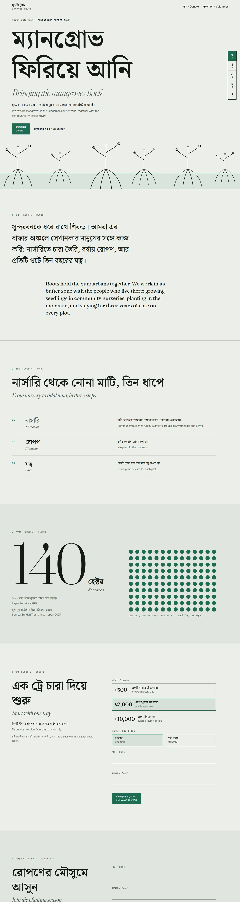 |
| 375 · reduced motion |  | 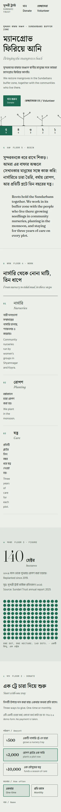 |

| Axis | baseline · GPT-5.4 | baseline · Gemini 3.1 | skill · GPT-5.4 | skill · Gemini 3.1 |
|---|---|---|---|---|
| Concept | 3 | 2 | 5 | 5 |
| Originality | 2 | 2 | 5 | 5 |
| Typography | 3 | 3 | 5 | 5 |
| Motion | 2 | 3 | 4 | 4 |
| Craft | 4 | 4 | 4 | 5 |
| Access & performance | 5 | 4 | 4 | 4 |
| **Weighted** | 62 | 58 | 91 | 94 |

| Measured | axe WCAG A/AA | keyboard → primary action | overflow @375 | text hidden (RM) | network idle | HTML |
|---|---|---|---|---|---|---|
| baseline | 0 | step 4 · ring 38/40 | 0px | 0 | 938 ms | 14 KB |
| skill | 0 | step 3 · ring 39/40 | 0px | 0 | 3644 ms | 32 KB |

**What changed:** The skill version sets the brief as a Manifesto with an inverted axis ("floors" counting down toward the roots), bilingual Bangla/English headings and the single real figure with its source. Both judges rated it much higher on Concept and Originality. The baseline was clean and accessible but conventional. The skill version is the heaviest page in the set (33 KB HTML, 3.6 s to network-idle on the local server).

## Failures

Not fixed in this run. Each is a real finding about the skill or about this benchmark.

1. **The release gate fails.** The skill version is not higher on every brief: it lost the hotel brief (54.5 vs 88.5) and, after gates, the studio brief (0 vs 81.5).
2. **The skill's own gates didn't catch its defects.** The studio captions are at 4.45:1. The hotel hero word splits on a phone, the page overflows by 105px, and the prices flip through wrong digits. The delivery gate in `gates/delivery-gate.md` requires checking all three, but in a one-shot run with no browser the model can't measure them. It printed a passing stamp anyway.
3. **The self-critique stamp is parroted.** All five skill outputs stamped `critique: C5 H4 S5 R4 M4 V5`, which is exactly the example in `gates/delivery-gate.md`. The judges' scores ranged from 40 to 97. The stamp is not evidence of quality.
4. **Signature IDs are invented.** Stamps name `courtyard-wall-lift`, `door-threshold`, `quiet-down`, `ink-fill`, `departure-board flip`; none of these are IDs in `data/signatures.csv`.
5. **Mutation repetition across briefs is a benchmark artifact.** All five `/invent` calls used `--seed 2026`, so the mutation sequence was the same for every brief (only the archetype bias differs by category). The model then picked the third draw (Borrow a print rule) in 4 of 5 briefs. Within each run the three draws were unique, as Task 5 guarantees, but the benchmark should have used a different seed per brief.
6. **One measurement was wrong.** My "text hidden under reduced motion" check counted the closed cart drawer on both e-commerce pages. GPT-5.4 treated that as a hard-gate failure for both, which lowered both Access & performance scores equally. The gated totals here do not apply that gate. Next run: exclude `[hidden]`, `inert` and closed-dialog subtrees.
7. **The judges disagree on single runs.** Hotel skill: 69 (GPT-5.4) vs 40 (Gemini). Studio baseline: 76 vs 87. With n = 1 per cell, these numbers show direction, not effect size.

## Not verified

- n = 1 per brief and condition, one generator model, one agent harness (a raw API call with the skill as system text, not Claude Code, Codex or Cursor running the skill's scripts).
- Motion was judged from stills plus the checks; nobody watched the animations. The Motion axis is the least trustworthy.
- The variety test (same brief 3× in one project, with `.motomation/log.json`) was not run.
- The skill-condition prompt is about 45k tokens longer than the baseline's; with this setup, length and instruction effects can't be separated.
- The local static server makes load times optimistic; there was no network throttling in this benchmark.

## Reproduce

Briefs: `evals/briefs/0{2,3,4,5,7}-*.md`. Per output: `index.html`, `meta.json` (model, timings, `/invent` text), `checks.json` (all measurements), `shot-*.webp`, `judge/<model>.json` (blind order + raw judge output). Contrast details: `contrast-failures.json`. Aggregates: `summary.json`.
